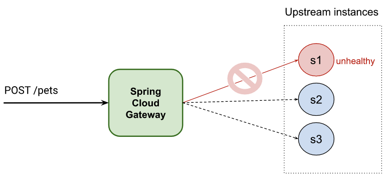

# Active Health Check strategies with Spring Cloud Gateway

Nowadays, services are compounded by other upstream services. This accelerates development and allows modules to be focused on specific responsibilities increasing their quality. This is one of the main things the microservices approach tries to solve.
However, jumping from one service to another could add extra latency, and this latency could be dramatically higher when the services are not responding.

If you are running microservices, you want to prevent your upstream services from being called when they are not working properly, even if they are using a circuit breaker pattern. It will also generate a penalty in the time response. For this reason, it is important to actively check your services in order to always call responding upstream services.

Last but not least, the features can be combined with a Circuit Breaker library to immediately fall back on an alternative endpoint without suffering the first miss penalty.

Goal: Routes will forward the request to the upstream services that are healthy using a load balancer strategy



This post is divided in two
1. "Spring features you need" - describing how you can benefit from Spring in order to get Active Health Check
2. "Registering endpoints for your services" - visiting some approaches for adding one or more endpoints to your routes

# 1. Spring features you need

There are three features in Spring that can help you to get Active Health Check

**Spring Cloud Load Balancer** (SLB) is a client-side load-balancer that allows to balance traffic along different upstream service endpoints. It is part of [Spring Cloud project](https://spring.io/projects/spring-cloud) and it is included in the spring-cloud-commons library ([SLB documentation](https://docs.spring.io/spring-cloud-commons/docs/current/reference/html/#spring-cloud-loadbalancer)).

**Client-side service discovery** feature allows the client to find and communicate with services without hard-coding the hostname and port. It is also included in the spring-cloud-commons library ([SSD documentation](https://docs.spring.io/spring-cloud-commons/docs/current/reference/html/#discovery-client)).

**Spring Cloud Gateway** supports both features and can be configured thanks to [LoadBalancerClientFilter](https://cloud.spring.io/spring-cloud-gateway/2.1.x/multi/multi__global_filters.html#_loadbalancerclient_filter)/[ReactiveLoadBalancerClientFilter](https://cloud.spring.io/spring-cloud-gateway/2.1.x/multi/multi__global_filters.html#reactive-loadbalancer-client-filter).

In this post, you can see different approaches to get the benefit of this global filter included out of the box. But first, let’s explore some of those features.

### Spring Cloud Load Balancer filter

A global filter for load balancing is included in Spring Cloud and can be activated using a special URI notation: "lb://your-service-name".

```yaml
spring:
 cloud:
   gateway:
     routes:
       - id: myRoute
         uri: lb://your-service-name
         predicates:
         - Path=/service/**
```
The load balancer filter, [ReactiveLoadBalancerClientFilter](https://cloud.spring.io/spring-cloud-gateway/2.1.x/multi/multi__global_filters.html#reactive-loadbalancer-client-filter) (for reactive applications), will detect the URI, and it will replace it by an **available** endpoint associated to "your-service-name".

Take into account that you need to register "your-service-name" into the Service Discovery registry. We will see different ways you can do it in the following sections. 

### Active Health Check

By default, traffic can be routed to all the upstream services,  even if they are unhealthy.
To prevent picking a bad one, you can enable the `health-check` configuration provided by the Load Balancer Client from Spring Cloud

```yaml
    spring:
      cloud:  
        loadbalancer:  
          configurations: health-check
```
All the endpoints will be checked periodically using the Spring Boot Actuator health endpoint automatically.
You can also customize some options like `spring.cloud.loadbalancer.health-check.<your-service-name>.path` and `spring.cloud.loadbalancer.health-check.interval`.

> Note: Default Health Check configuration will check the upstream service endpoints using the `/actuator/health` endpoint by default, which requires activating Spring Actuator in your upstream service.

For more options, explore the [LoadBalancerClientsProperties](https://github.com/spring-cloud/spring-cloud-commons/blob/main/spring-cloud-commons/src/main/java/org/springframework/cloud/client/loadbalancer/LoadBalancerClientsProperties.java) and [LoadBalancerProperties](https://github.com/spring-cloud/spring-cloud-commons/blob/main/spring-cloud-commons/src/main/java/org/springframework/cloud/client/loadbalancer/LoadBalancerProperties.java) class

Note: There is a built-in feature in Spring Cloud Gateway that will deploy all the services available as routes. 
This post describes the opposite, so we are declaring routes that will be load balanced including active health check.

# 2. Registering endpoints for your services

In the previous section, you have specified a Load Balanced URI (lb://your-service-name), but now you need to register the endpoints associated with the service name of the URI.
We are visiting some approaches in the following sections.

## Static approach

You can activate client load balancing statically configuring the property `spring.cloud.discovery.client.simple.instances`.
It is a map whose key is the service name (used by the lb://<service-name> URI) and the value is an array of `org.springframework.cloud.client.ServiceInstance` objects that will point to the upstream services.

Some benefits of static load balancing are
* Load balancing could distribute traffic between multiple instances, sharing any stress of the services and reducing the probability of crashing
* Fault tolerance

The problem is that you are setting statically the upstream services in your configuration. If you need to change the list, you need to restart your application.

Example:
```yaml
spring:
  cloud:
    gateway:
      routes:
        - uri: lb://hello-service # Load Balancer URI handled by ReactiveLoadBalancerClientFilter
          predicates:
            - Path=/hello
    loadbalancer:
      configurations: health-check # Required for enabling SDC with Health Checks
    discovery:
      client:
        simple: # SimpleDiscoveryClient to configure statically services
          instances:
            hello-service:
              - secure: false
                port: 8090
                host: localhost
                serviceId: hello-service
                instanceId: hello-service-1
              - secure: false
                port: 8091
                host: localhost
                serviceId: hello-service
                instanceId: hello-service-2
```

### Trying out

1. Run servers
```shell
# Run server 1
SERVER_PORT=8090 ./gradlew :service:bootRun
```
```shell
# Run server 2
SERVER_PORT=8091 ./gradlew :service:bootRun
```

2. Check http://localhost:8090/actuator/health is "UP"

```shell
curl http://localhost:8090/actuator/health
```
> {"status":"UP"}

3. Test http://localhost:8080/hello responds 200 OK

```shell
curl localhost:8090/hello
```
> { "message": "hello world!"}%

4. Run Spring Cloud Gateway

```shell
./gradlew :1-service-disc-by-properties:bootRun
```

5. Test Spring Cloud Gateway balancer

```shell
curl localhost:8881/hello
```
> { "message": "hello world from port 8090!"}%
```shell
curl localhost:8881/hello
```
> { "message": "hello world from port 8091!"}%

You could need to run multiple times the previous commands to get a response from a different server.

6. Mark server 1 as unhealthy sending PUT request to http://localhost:8090/status/false

```shell
curl localhost:8090/status/false -X PUT
```

7. Check http://localhost:8090/actuator/status is "DOWN"

```shell
curl http://localhost:8090/actuator/health
```
> {"status":"DOWN"}

8. Run multiple times a GET request to http://localhost:8881/hello and see that you only gets responds from port 8091

You could receive one respond on port 8090 owing the healthcheck haven't checked the endpoint when you send the request.
The interval can be modified in the property `spring.cloud.loadbalancer.health-check.interval`

Also, you can see some messages that describes one of the upstream endpoints is not healthy, and therefore, it is unavailable.
> 2023-05-08 14:59:53.151 DEBUG 9906 --- [ctor-http-nio-3] r.n.http.client.HttpClientOperations     : [12d42e83-77, L:/127.0.0.1:57439 - R:localhost/127.0.0.1:8090] Received response (auto-read:false) : RESPONSE(decodeResult: success, version: HTTP/1.1)
> HTTP/1.1 503 Service Unavailable

```shell
curl localhost:8881/hello
```
> { "message": "hello world from port 8091!"}%

9. Mark server 2 as unhealthy sending PUT request to http://localhost:8091/status/false

```shell
curl localhost:8091/status/false -X PUT
```

10. Run some GET requests to http://localhost:8881/hello and see that it responds "503 Service Unavailable"

```shell
curl localhost:8881/hello
```
> {"timestamp":"2023-05-08T13:07:48.704+00:00","path":"/hello","status":503,"error":"Service Unavailable","requestId":"6b5d6010-199"}%

## Eureka integration (+complex, dynamic)

Having a static configuration is not so flexible, and Eureka as service discovery server removes that drawback.

The counterpart is that you require a new component in your architecture increasing maintenance. This could be not an option for some clients.

```yaml
    spring:
      application:
        name: scg-client-with-eureka
      cloud:
        loadbalancer:
          configurations: health-check # Note: required for enabling SDC with Health Checks - remove this line if you want to reproduce issues because not using HealthChecks in LB
          # Note: LoadBalancerCacheProperties.ttl (or spring.cloud.loadbalancer.cache.ttl) is 35 by default - You will need to wait 35secs after an instance turns healthy
        gateway:
          httpclient:
            wiretap: true
          routes:
            - uri: lb://hello-service
              predicates:
                - Path=/headers
              filters:
                - StripPrefix=0
    
    eureka:
      client:
        webclient:
          enabled: true
        serviceUrl:
          defaultZone: http://localhost:8761/eureka
        fetchRegistry: true
        registerWithEureka: false
      instance:
        preferIpAddress: true
```

### Trying out

1. Run Eureka Server
```shell
./gradlew :eureka-server:bootRun
```

2. Run servers including `eureka` profile
```shell
# Run server 1
SPRING_PROFILES_ACTIVE=eureka SERVER_PORT=8090 ./gradlew :service:bootRun
```
```shell
# Run server 2
SPRING_PROFILES_ACTIVE=eureka SERVER_PORT=8091 ./gradlew :service:bootRun
```

3. Go to http://localhost:8761/ and check the servers are included  as instance of the application `hello-service`

4. Test Spring Cloud Gateway balancer

```shell
curl localhost:8881/hello
```
> { "message": "hello world from port 8090!"}%
```shell
curl localhost:8881/hello
```
> { "message": "hello world from port 8091!"}%

5. Run Spring Cloud Gateway

```shell
./gradlew :3-eureka-service-disc:bootRun
```

6. Mark server 1 as unhealthy sending PUT request to http://localhost:8090/status/false

```shell
curl localhost:8090/status/false -X PUT
```

You should see in the Eureka dashboard that there is only one instance available, and, you will see some logs messages complaining that service on port 8090 is not available.
The health check is not immediate, so you could need to wait a few seconds to see the instance marked as DOWN.

## Custom Filter at Route level (dynamic approach)

As you know, Spring Cloud Gateway brings the option for creating your own custom filters.
Also, applying filters and changing routes without restarting your gateway is possible.

In this section, you can see a custom filter implementation for having load balancing and health checks of your services via Spring Cloud Gateway route configuration.

If you already have a service discovery server in your project, maybe this is not the best option for you. Nevertheless, this is a simple and cheap way to get two great features in your project.

```yaml
    spring:
      application:
        name: custom-service-disc
      cloud:
        loadbalancer:
          configurations: health-check # Note: required for enabling SDC with Health Checks - remove this line if you want to reproduce issues because not using HealthChecks in LB
          # Note: LoadBalancerCacheProperties.ttl (or spring.cloud.loadbalancer.cache.ttl) is 35 by default - You will need to wait 35secs after an instance turns healthy
        gateway:
          routes:
            - uri: lb://hello-service
              id: load-balanced
              predicates:
                - Path=/load-balanced/**
              filters:
                - StripPrefix=1
                - LoadBalancer=localhost:8090;localhost:8091;localhost:8092
```
The new  `LoadBalancer` route filter allows you to configure the upstream service endpoints associated with the `lb://hello-service` load balancer URI.

```
@Component
public class LoadBalancerGatewayFilterFactory extends AbstractGatewayFilterFactory<LoadBalancerGatewayFilterFactory.MyConfiguration> {

	// ...

	@Override
	public GatewayFilter apply(MyConfiguration config) {
		return (exchange, chain) -> {
			final Route route = exchange.getAttribute(GATEWAY_ROUTE_ATTR);
			if (StringUtils.hasText(config.getInstances()) && route.getUri().getScheme().equals("lb")) {
				config.getServiceInstances(route.getUri().getHost()).forEach(discoveryClient::addInstance);
			}

			return chain.filter(exchange);
		};
	}

```

As you can see, if a route matches the pattern `lb://<service-host>`  the `LoadBalancerGatewayFilterFactory` will associate all the upstream service endpoints coming from the filter configuration to the `service-host`.

Under the hood, a new  `ReactiveCustomDiscoveryClient` discovery client implementation has been included in order to manage upstream service endpoints in our code. 
Spring detects such bean, and, it will prioritize it in the list of [DiscoveryClient](https://github.com/spring-cloud/spring-cloud-commons/blob/main/spring-cloud-commons/src/main/java/org/springframework/cloud/client/discovery/DiscoveryClient.java) used to determine available endpoints.

### Trying out

1. Run servers
```shell
# Run server 1
SERVER_PORT=8090 ./gradlew :service:bootRun
```
```shell
# Run server 2
SERVER_PORT=8091 ./gradlew :service:bootRun
```

2. Check http://localhost:8090/actuator/health is "UP"

```shell
curl http://localhost:8090/actuator/health
```
> {"status":"UP"}

3. Test http://localhost:8080/hello responds 200 OK

```shell
curl localhost:8090/hello
```
> { "message": "hello world!"}%

4. Run Spring Cloud Gateway

```shell
./gradlew :2-custom-service-disc:bootRun
```

5. Test Spring Cloud Gateway balancer

```shell
curl localhost:8882/hello
```
> { "message": "hello world from port 8090!"}%
```shell
curl localhost:8882/hello
```
> { "message": "hello world from port 8091!"}%

You could need to run multiple times the previous commands to get a response from a different server.

6. Mark server 1 as unhealthy sending PUT request to http://localhost:8090/status/false

```shell
curl localhost:8090/status/false -X PUT
```

7. Check http://localhost:8090/actuator/status is "DOWN"

```shell
curl http://localhost:8090/actuator/health
```
> {"status":"DOWN"}

8. Run multiple times a GET request to http://localhost:8881/hello and see that you only gets responds from port 8091

You could receive one respond on port 8090 owing the healthcheck haven't checked the endpoint when you send the request.
The interval can be modified in the property `spring.cloud.loadbalancer.health-check.interval`

Also, you can see some messages that describes one of the upstream endpoints is not healthy, and therefore, it is unavailable.
> 2023-05-08 15:59:53.151 DEBUG 9906 --- [ctor-http-nio-2] r.n.http.client.HttpClientOperations     : [12d42e83-77, L:/127.0.0.1:57439 - R:localhost/127.0.0.1:8090] Received response (auto-read:false) : RESPONSE(decodeResult: success, version: HTTP/1.1)
> HTTP/1.1 503 Service Unavailable

```shell
curl localhost:8882/hello
```
> { "message": "hello world from port 8091!"}%

9. Mark server 2 as unhealthy sending PUT request to http://localhost:8091/status/false

```shell
curl localhost:8091/status/false -X PUT
```

10. Run some GET requests to http://localhost:8881/hello and see that it responds "503 Service Unavailable"

```shell
curl localhost:8882/hello
```
> {"timestamp":"2023-05-08T14:07:48.704+00:00","path":"/hello","status":503,"error":"Service Unavailable","requestId":"6b5d6010-199"}%


### Next steps

In this post you have seen multiple ways to get load balancing and active health checks in your projects.

From the static approach for basic projects or proof of concepts where the number of upstream services doesn’t change. 
And a more dynamic approach, using Eureka or Spring Cloud Gateway filters.

To sum up, you have also seen that Spring Cloud Gateway approach is a great option if you don’t need to add an extra component to your architecture.

# Additional Resources

Want to learn more about Spring Cloud? Join us virtually at [Spring Academy](https://spring.academy)!
Want to get **Active Health Check** just by adding a property in your route without getting your hands dirty? Take a look at our commercial platform with Kubernetes support.
